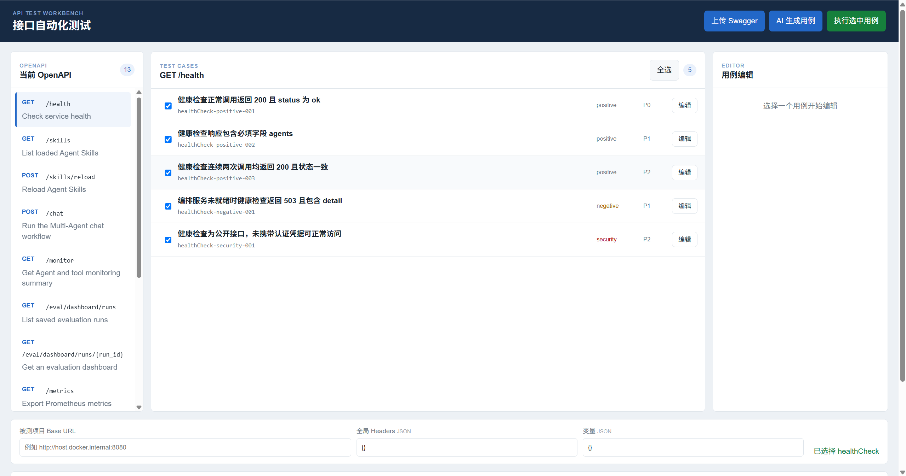

# API Test Workbench

API Test Workbench is a lightweight, data-driven API automation testing framework built with Python, Requests, Pytest, and Docker.



## What It Does

- Imports local Swagger/OpenAPI JSON or YAML files.
- Lists the APIs defined in an OpenAPI document.
- Generates structured API test cases for a selected operation with DeepSeek.
- Designs evidence-based positive, negative, boundary, dependency, and security cases.
- Supports manual editing, deletion, enabling, and disabling of test cases.
- Executes selected cases against any target API service.
- Supports status-code, JSONPath, header, response-time, variable extraction, and dependency checks.
- Converts selected JSON cases to temporary Excel files and reuses the Pytest execution engine.
- Produces test logs and standard Allure result files.
- Provides both a command-line workflow and a simple web interface.

## Architecture

```text
Swagger/OpenAPI
      |
      v
OpenAPI Importer -> Interface List -> AI Case Generator
                                      |
                                      v
                         JSON Cases -> Temporary Excel
                                      |
                                      v
                              Pytest + Requests
                                      |
                                      v
                            Test Results and Allure
```

## Quick Start

Requirements:

- Docker Desktop

Start the web interface and the built-in demo API:

```bash
docker compose up --build web demo-api
```

Open:

```text
http://localhost:8000
```

Upload `examples/openapi/demo_openapi.yaml`, select an API, and click **AI Generate Cases**.

For the built-in demo API, use this target Base URL in the web interface:

```text
http://demo-api:8000
```

## DeepSeek Configuration

Create `.env` from `.env.example` and set the API key locally. The key is read only from the `DEEPSEEK_API_KEY` environment variable and is excluded from Git.

Run the automated tests:

```bash
docker compose run --rm api-test pytest -q
```

## Command-Line Usage

Run the default Excel cases:

```bash
docker compose run --rm api-test pytest -q
```

Run a specific Excel file:

```bash
docker compose run --rm api-test pytest -q --case-file reports/ai_generated_cases.xlsx
```

Import an OpenAPI document and create basic cases:

```bash
docker compose run --rm api-test \
  python tools/import_openapi.py \
  --input examples/openapi/demo_openapi.yaml \
  --output reports/imported_interfaces.json \
  --excel-output reports/imported_cases.xlsx
```

Generate cases for one operation with DeepSeek:

```bash
docker compose run --rm api-test \
  python tools/generate_ai_cases.py \
  --input reports/imported_interfaces.json \
  --output reports/ai_generated_cases.json \
  --excel-output reports/ai_generated_cases.xlsx \
  --operation-id login
```

Run the generated cases against a target service:

```bash
docker compose run --rm \
  -e API_BASE_URL=http://host.docker.internal:8002 \
  api-test pytest -q --case-file reports/ai_generated_cases.xlsx
```

When the target service runs in another Docker Compose project, use its published host port with `host.docker.internal`, or use a shared Docker network and the service name.

## Web Workflow

1. Upload a Swagger/OpenAPI JSON or YAML file.
2. Select one API operation.
3. Generate test cases with DeepSeek.
4. Review, edit, delete, enable, or disable cases.
5. Enter the target service Base URL.
6. Select cases and execute them.
7. Review the result summary, logs, and Allure results.

## Project Layout

```text
ai/          AI client, prompts, skills, and output validation
common/      Shared utilities
core/        Case loading, requests, assertions, extraction, and execution
examples/    Demo API and OpenAPI examples
tests/       Automated tests for the framework
tools/       OpenAPI import and case generation commands
web/         FastAPI web interface and static frontend
```
